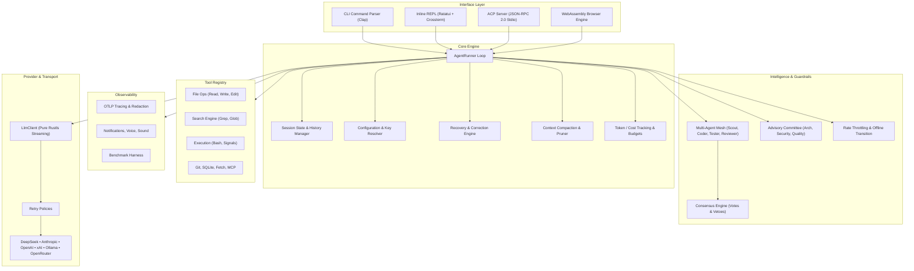

<div align="center">

# Fusion

**Fast, ultra-lightweight, cross-platform AI coding assistant written in 100% pure Rust.**
*Runs natively on macOS, Linux, Windows, Android/Termux, and in the Browser via WebAssembly.*

[](LICENSE)
[](https://www.rust-lang.org)
[]()
[-purple.svg)]()
[]()
[]()

[**Quick Install**](#quick-install) • [**Quickstart**](#quickstart) • [**Vision**](#vision) • [**Core Features**](#features) • [**Multi-Agent Mesh & Advisors**](#multi-agent-mesh--advisors) • [**Architecture**](#architecture-overview) • [**Configuration**](#configuration) • [**Contributing**](#contributing)

---

</div>

## <a id="quick-install"></a>Quick Install

Choose your preferred installation method:

### 1. One-Line Installer (macOS & Linux)

```bash
curl -fsSL https://fusion.sh/install.sh | bash
```

### 2. Android / Termux Bootstrap (Mobile Coding)

Fusion is optimized for mobile development inside Termux on Android devices:

```bash
# Update repositories and install curl
pkg update && pkg install -y curl

# Install standalone precompiled ARM64/AArch64 binary
curl -fsSL https://fusion.sh/install-termux.sh | bash
```

*Or build directly inside Termux:*
```bash
pkg install -y rust git
cargo install --locked fusion
```

### 3. macOS & Linux via Homebrew

```bash
brew install theaungmyatmoe/tap/fusion
```

### 4. Windows via Scoop or Winget

**Via Scoop:**
```powershell
scoop bucket add fusion https://github.com/theaungmyatmoe/scoop-bucket
scoop install fusion
```

**Via Winget:**
```powershell
winget install theaungmyatmoe.fusion
```

### 5. From Source via Cargo

```bash
cargo install --locked fusion
```

*Or clone and build locally:*
```bash
git clone https://github.com/theaungmyatmoe/fusion.git
cd fusion
cargo build --release
# Executable located at ./target/release/fusion
```

### 6. Browser WebAssembly (Zero Install)

Experience Fusion immediately in your browser with zero installation:
- **Live Demo**: [https://fx.sh/try](https://fx.sh/try)
- Features the interactive tabbed model selector, client-side virtual filesystem, and direct browser LLM streaming.

---

## <a id="quickstart"></a>Quickstart

### 1. Configure Provider API Keys

Set any of the supported provider environment variables:

```bash
# Fusion API (Recommended — the project's own provider endpoint)
export FUSION_API_KEY="..."

# DeepSeek (High performance and low cost)
export DEEPSEEK_API_KEY="sk-..."

# Anthropic Claude
export ANTHROPIC_API_KEY="sk-ant-..."

# OpenAI
export OPENAI_API_KEY="sk-proj-..."

# xAI Grok
export XAI_API_KEY="xai-..."

# OpenRouter (Unified gateway to 200+ models)
export OPENROUTER_API_KEY="sk-or-..."
```

> **Fusion API**: The project's own OpenAI-compatible provider endpoint at
> `http://api.fusioncode.app/v1`. It is the default supported provider —
> set `FUSION_API_KEY` and run:
> ```bash
> fusion -p fusion
> ```

### 2. Launch Interactive Inline REPL

Simply execute:

```bash
fusion
```

```text
  Fusion v0.3.0 (Pure-Rust AI Coding Assistant)
  Provider: deepseek  Model: deepseek-chat  Advisors: on
  Type your prompt, /help for commands, or Ctrl+D / /exit to quit.

> Explain the concurrency architecture in src/agent/loop_runner.rs
```

### 3. Non-Interactive / Scripting Mode

Execute single-turn commands or pipe prompts directly:

```bash
# Run one-off task
fusion "Find all public functions in src/tools and output a table"

# Override model and provider for a complex reasoning task
fusion -p deepseek -m deepseek-reasoner "Analyze deadlock risks in async locks"

# Pipe code into Fusion
git diff | fusion "Generate a conventional git commit message for these changes"
```

### 4. TypeScript SDK (Browser / Node.js)

```bash
npm install @fusion/sdk
```

```typescript
import { FusionAgent, VirtualFs } from "@fusion/sdk";

const agent = new FusionAgent({
  provider: "openrouter",
  apiKey: process.env.OPENROUTER_API_KEY,
  fs: new VirtualFs(),          // sandboxed in-memory workspace
  advisors: true,               // concurrent advisor guardrails
});

for await (const event of agent.run("Refactor the auth module for caching")) {
  if (event.type === "text") process.stdout.write(event.delta);
  if (event.type === "tool") console.log(`[tool] ${event.name}: ${event.status}`);
  if (event.type === "advisor") console.log(`[advisor] ${event.advisor}: ${event.risk}`);
}
```

See the [SDK README](sdk/README.md) for the full API, xterm.js adapter, and session checkpoints.

### 5. IDE Integration (ACP)

```bash
fusion --acp
```

Point Zed, Neovim, or JetBrains at Fusion over the Agent Client Protocol — see [ACP Support](#agent-client-protocol-acp).

---

## <a id="vision"></a>Vision

Modern AI coding tools have grown bloated, sluggish, and fragile. Running on heavy Electron or Node/Python runtimes, they consume gigabytes of RAM, take seconds to start, demand complex toolchains (C/C++ compilers, OpenSSL, protoc), and fail miserably on mobile or resource-constrained environments like Android/Termux.

**Fusion is built on a different philosophy:**
1. **Zero Compromises on Performance**: Sub-15ms cold start, single static binary under 15MB, and under 25MB resident memory.
2. **Pure Rust Ecosystem**: Zero C/C++ dependencies, pure-Rust TLS via `rustls-tls-native-roots`, compile anywhere without system library headaches.
3. **True Cross-Platform Ubiquity**: A first-class citizen on **macOS** (Apple Silicon & Intel), **Linux** (x86_64, aarch64, musl), **Windows**, **Android/Termux** (code from your phone or tablet on the go!), and **Browser WebAssembly (WASM)**.
4. **Autonomous Intelligence with Guardrails**: Built-in parallel **Subagents** for delegated tasks alongside a concurrent **Advisory Committee** (Architecture, Security, and Code Quality) to catch bugs and vulnerabilities before they happen.
5. **Open Protocols**: Native support for the **Agent Client Protocol (ACP)** over JSON-RPC 2.0 stdio, seamlessly integrating with Zed, Neovim, JetBrains, and modern editors.

### Fusion vs. Heavyweight Alternatives

| Feature | Fusion v0.3.0 | Heavyweight Node / Python CLIs |
| :--- | :--- | :--- |
| **Startup Time** | **< 15 ms** | 1,200 ms – 4,500 ms |
| **Idle Memory (RSS)** | **< 25 MB** | 250 MB – 900 MB |
| **Dependencies** | **Pure Rust** (No C, No OpenSSL, No protoc) | Node.js / Python, OpenSSL, native C++ node-gyp |
| **Android / Termux** | **Native 1st-class support** out of the box | Broken bindings, heavy crashes, root required |
| **Browser WASM** | **Runs in browser (`fx.sh/try`)** | Not possible |
| **Advisory Committee** | **Built-in parallel Architecture/Security advisors** | None or single sequential prompt |
| **Subagent Mesh** | **Concurrent async worker roles** (Scout, Coder, Tester, Reviewer) | None or monolithic blocking agent |
| **IDE Protocol** | **Native ACP (Agent Client Protocol) stdio server** | Proprietary or custom webhooks |

---

## <a id="features"></a>Core Features

### 1. Minimalist Inline UI & Streaming Renderer

- **Lightweight Inline View**: Built on Ratatui and Crossterm without hijacking your entire terminal buffer. Your shell scrollback and commands remain clean and visible.
- **Fluid Streaming Markdown**: Instant syntax highlighting, tables, callouts, and code blocks rendered in real time as tokens arrive.
- **Animated Spinners & Tool Status**: Visual status indicators when files are being read, edited, grepped, or checked by advisors.
- **Multiline Input**: Press `Ctrl+J`, `Shift+Enter`, or terminate a line with `\` to compose multiline queries.
- **Theming & Keymap Customization**: Runtime theme engine and configurable keybindings (`/config`, `keymap`).
- **Progress Trees & Agent Tree View**: Live hierarchical visualization of concurrent subagent and advisor activity.

### 2. Multi-Provider & Dynamic Model Catalog

Seamlessly toggle between top-tier frontier models and local private LLMs. Includes smart shorthand resolution and a dynamically synchronized model catalog that fetches available models from all configured providers concurrently:

| Provider | Transport | API Key | Example |
| **Fusion** | Cloud streaming (native) | `FUSION_API_KEY` | `fusion -p fusion -m fusion-chat` |
| **DeepSeek** | Cloud streaming | `DEEPSEEK_API_KEY` | `fusion -m deepseek-reasoner` |
| **Anthropic** | Cloud streaming | `ANTHROPIC_API_KEY` | `fusion -m claude-3-7-sonnet` |
| **OpenAI** | Cloud streaming | `OPENAI_API_KEY` | `fusion -m gpt-4o` |
| **xAI** | Cloud streaming | `XAI_API_KEY` | `fusion -m grok-2-latest` |
| **OpenRouter** | Unified gateway (200+ models) | `OPENROUTER_API_KEY` | `fusion -p openrouter -m any/model` |

Smart shorthands: `/model v3` (DeepSeek V3), `/model r1` (DeepSeek R1), `/model sonnet` (Claude 3.5 Sonnet), `/model 4o` (GPT-4o), `/model grok` (Grok 2).

### 3. Agent Engine Resilience

- **Recovery Engine**: Automatic error diagnosis and correction attempts for transient failures; resumable sessions via `/recover [status|resume|diff|discard]`.
- **Rate Throttling**: Token-bucket turn rate limits with wait-duration feedback and banner visualization when provider limits are hit.
- **Retry Policies**: Configurable per-provider retry with retryable-status detection and exponential backoff.
- **Automatic Offline Transition**: Detects connectivity loss and seamlessly transitions to local Ollama execution.
- **Context Compaction**: Budget-aware history compaction with aggressive/conservative strategies and thinking/tool prune policies; manual `/compact`.
- **Session Pruner**: Preserve recent turns, initial goals, or tool results while aggressively pruning stale context.
- **Undo / Redo & Checkpoints**: Every file mutation snapshots original content and permissions for instant restore; `/rewind [N]` rewinds sessions turn-by-turn.
- **Heartbeat Monitoring**: Phase-transition records and threshold-based liveness metrics for long-running turns.

### 4. Token, Cost & Tracing Subsystem

- **Token Accounting**: Real-time input/output/cache token analytics with per-provider pricing.
- **Cost Breakdown**: Formatted USD costs with cache-savings percentages and budget warnings.
- **Pricing Sync**: Dynamically fetches and caches current model pricing from providers.
- **OpenTelemetry (OTLP) Tracing**: Standard-compatible trace/span IDs, span kinds, and OTLP span conversion; `/trace [path]` exports trace files with secret-redaction audits.
- **Secret Scanning**: Automatic credential and secret redaction before traces and exports leave the process.

### 5. Productivity & Session Management

- **Persistent Sessions**: Save, load, search, and manage conversations across restarts; JSONL export.
- **Bookmarks & Tags**: Named conversation checkpoints (`/bookmark`) and conversation filtering (`/tag`).
- **Fork & Rewind**: Branch sessions at any turn for alternative approaches; turn-level preview diffs.
- **Snippets & Prompt Library**: Reusable code snippets and saved prompt templates with search.
- **Skills Registry**: Loadable, testable, tag-filtered skill modules (`/skills`).
- **Commit Generator**: Conventional-commit message generation from unified git diffs.
- **Export**: Markdown, HTML, and JSONL conversation export with print-ready CSS.
- **Voice & Notifications**: Pure-Rust voice activity detection, speech-to-text input, text-to-speech feedback, and cross-platform desktop notifications (`notify-send`, `osascript`, Windows toasts).

### 6. Benchmarking

- **Interactive Benchmarks**: `/benchmark [provider]` (aliases `/bench`, `/latency`, `/speed`) measures provider latency and throughput with high-precision timing and token-budget protection.
- **Comparison Harness**: Head-to-head provider/model comparison benchmarks under `benches/` with criterion-based Rust micro-benchmarks.

---

## <a id="multi-agent-mesh--advisors"></a>Multi-Agent Mesh & Advisors

### Multi-Agent Mesh (Parallel Subagents)

Fusion delegates complex, multi-stage engineering tasks to specialized background subagents that execute concurrently without blocking the primary loop:

```text
                  +------------------------+
                  |   Lead Agent Runner    |
                  +-----------+------------+
                              |
            +-----------------+-----------------+
            v                 v                 v
   +----------------+ +----------------+ +------------------+
   | Scout Subagent | | Coder Subagent | | Tester Subagent  |
   | (Read / Grep)  | | (Edit / Write) | | (Bash / Verify)  |
   +----------------+ +----------------+ +------------------+
```

- **`Scout`**: Fast, read-only exploration specialist. Uses `grep`, `glob`, and `read` to map dependencies, inspect architecture, and index files without risk of accidental mutations.
- **`Coder`**: Surgical implementation specialist. Applies targeted diffs and replacements using the `edit` and `write` tools adhering strictly to idiomatic patterns.
- **`Tester`**: Verification and diagnosis specialist. Runs targeted tests via the `bash` tool, captures outputs, isolates failures, and verifies regression tests.
- **`Reviewer`**: In-depth static audit specialist. Examines diffs for logic bugs, memory safety, and cross-platform quirks.
- **`General / Custom`**: Configurable worker agents tailored dynamically for user-defined pipelines.

Each subagent runs in an isolated task context with role-restricted toolsets, progress reporting channels, and lifecycle metrics. Agents coordinate through a peer **Mesh** supporting broadcast messages, direct messages with reply channels, and peer queries.

### Advisory Committee (Concurrent Automated Review)

Before executing high-impact code modifications or risky shell commands, Fusion consults a concurrent committee of specialized advisors:

| Advisor | Domain & Responsibilities | Risk Triggers |
| :--- | :--- | :--- |
| **Architecture Advisor** | Modularity, separation of concerns, DRY/SOLID principles, cross-platform safety (preventing OS-specific path leaks). | Monolithic bloat, tight coupling, broken platform abstractions. |
| **Security Advisor** | Command injection defense, credential & secret protection (`.env`, private keys), prevention of destructive shell scripts (`rm -rf`, raw disk ops). | Shell injection, token leaks, privilege escalation. |
| **Code Review Advisor** | Rust idioms, error propagation (`anyhow`/`thiserror`), zero-allocation designs, asynchronous cancellation safety, test coverage. | `unwrap()` in production code, excessive cloning, unhandled edge cases. |

Advisors assess proposed plans with structured risk levels: **`LOW`**, **`MEDIUM`**, **`HIGH`**, or **`CRITICAL`**. If critical risks are detected, execution halts with actionable critique and remediation suggestions. A weighted **Consensus Engine** aggregates advisor votes, supports vetoes, and resolves conflicting critiques before approval.

---

## <a id="agent-client-protocol-acp"></a>Agent Client Protocol (ACP) Support

Fusion features a built-in JSON-RPC 2.0 stdio server implementing the standard **Agent Client Protocol (ACP)**. This allows modern editors and IDEs (such as Zed, Neovim, JetBrains, and VS Code) to use Fusion directly as their native AI assistant engine:

```bash
# Start Fusion in ACP server mode over standard I/O
fusion --acp
```

The ACP engine provides granular session update events, token-by-token streaming, tool status tracking, advisor feedback lifecycles, and bidirectional notification bridging. It runs over any reader/writer pair — stdio, WebSocket, or in-process streams for testing.

### Example: Configuring in Zed Editor

Add Fusion as a custom ACP agent in your `~/.config/zed/settings.json`:

```json
{
  "assistant": {
    "version": "2",
    "provider": {
      "name": "custom",
      "command": "fusion",
      "args": ["--acp"]
    }
  }
}
```

### Example: Configuring in Neovim

```lua
require("fusion-acp").setup({
  cmd = { "fusion", "--acp" },
  autostart = true,
})
```

---

## <a id="wasm--typescript-sdk"></a>WebAssembly & TypeScript SDK

### Browser Playground

Compile and run the entire Fusion agent engine inside any WebAssembly-compatible browser:
- **Live Interactive Playground**: [https://fx.sh/try](https://fx.sh/try)
- **Tabbed Model Picker**: Instant visual switching across providers and models.
- **Virtual Memory FS**: Sandboxed in-browser code exploration and editing with `read`, `write`, `edit`, `grep`, `glob`, and simulated `bash` tools.
- **xterm.js Terminal**: WebSocket ACP bridge to a full in-browser terminal experience.

### TypeScript SDK (`@fusion/sdk`)

The [official SDK](sdk/README.md) wraps the pure-Rust WASM core for Browser and Node.js (>= 18):

- **In-Memory Virtual File System (VFS)** with session checkpoint serialization.
- **Streaming Token & Event Pipeline**: real-time deltas for thinking traces, text, tool executions, advisor critiques, and token analytics.
- **Multi-Agent Advisors**: Architect, Security, and Performance critiques before and after tool calls.
- **Xterm.js Terminal Adapter** with ANSI coloring, auto-wrapping, history navigation, and slash commands.
- **Universal Model Support**: OpenRouter, Anthropic, OpenAI, DeepSeek, and local Ollama.

---

## <a id="built-in-tools"></a>Built-in Tools

Fusion includes a sandboxed, cross-platform tool registry:

| Tool | Description |
| :--- | :--- |
| **`read` / `read_file`** | Surgical file reading with offset and line-limit selectors. |
| **`write` / `write_file`** | Safe file writing and creation. |
| **`edit` / `edit_file`** | Accurate text replacement and block patching with unambiguous anchor detection. |
| **`grep`** | High-speed regex and literal searching with `.gitignore` awareness and result filtering. |
| **`glob`** | Fast pattern-based directory and file scanning. |
| **`bash`** | Asynchronous command execution with timeouts, output truncation protection, and signal cancellation. |

Extended registry:

| Tool | Description |
| :--- | :--- |
| **`git` / `git_log` / `git_branch`** | Repository inspection, history, and branch queries. |
| **`fetch` / `web_search`** | HTTP fetching and web search. |
| **`sqlite`** | Embedded SQLite queries with typed cell values. |
| **`test_runner` / `regex_test`** | Targeted test execution and regex validation. |
| **`symbols` / `syntax` / `dep_graph` / `deps`** | Symbol indexing, syntax inspection, and dependency analysis. |
| **`diff_stats` / `patch` / `format` / `docgen` / `crate_docs`** | Diff analytics, patch application, code formatting, and documentation generation. |
| **`watch` / `process` / `ports` / `system` / `env_cleaner` / `profiler`** | File watching, process/port inspection, system diagnostics, environment hygiene, and profiling. |
| **`clipboard` / `hex` / `secret_scan` / `guardrails` / `mock_server`** | Clipboard access, hex dumps, secret detection, safety guardrails, and HTTP mocking. |
| **`mcp` / `mcp_bridge`** | Model Context Protocol JSON-RPC client and bridge for external tool servers. |
| **`compat`** | Legacy tool-name compatibility mapping. |

---

## <a id="architecture-overview"></a>Architecture Overview

Fusion is crafted with clean separation of concerns and zero unnecessary abstraction layers:



### Pure Rust Dependency Manifesto

- **No C/C++ build dependencies**: Avoids `gcc`, `clang`, `cmake`, and `make` during installation.
- **No OpenSSL**: Eliminates shared object version mismatches across Linux distributions and Android NDK.
- **No Protocol Buffers compiler**: Zero requirement for external `protoc` binaries.

### Source Layout

```text
src/
  acp/          ACP JSON-RPC 2.0 server, event streaming, WebSocket bridge
  agent/        AgentRunner loop, mesh, subagents, advisors, consensus,
                recovery, compaction, pruner, undo, bookmarks, cost,
                tracing (OTLP), throttle, skills, snippets, fork/rewind
  cli/          CLI parsing, shell completion generation
  config/       Config loading, env resolution, migration, presets, workspaces
  provider/     LlmClient, provider adapters, model catalog, retry, offline mode
  tools/        Sandboxed tool registry (files, search, git, sqlite, MCP, ...)
  ui/           Inline REPL, markdown renderer, slash commands, themes, voice
  wasm.rs       WASM bindings, VirtualFs, browser engine
sdk/            TypeScript SDK (@fusion/sdk) — types, xterm adapter, WASM core
web/            Browser playground (xterm.js + WebSocket ACP)
Formula/        Homebrew formula
benches/        Criterion micro-benchmarks & provider comparison harness
scripts/        install.sh, termux-bootstrap.sh, package.sh, verify.sh
tests/          CLI, multi-agent, smoke, and WASM integration tests
```

---

## <a id="slash-commands"></a>Slash Commands

Interactive command reference (browsable in-app via `/help` and `/palette`):

| Command | Syntax | Description |
| :--- | :--- | :--- |
| `/help` | `/help [command]` | Browse command help and shortcuts (aliases `/h`, `/?`). |
| `/palette` | `/palette [filter]` | Searchable command palette (aliases `/commands`, `/pal`). |
| `/clear` | `/clear` | Reset conversation history (aliases `/cls`, `/c`). |
| `/file` | `/file [query]` | Fuzzy file picker (aliases `/f`, `/find`). |
| `/status` | `/status` | Session tokens, context usage, environment state. |
| `/quit` | `/quit` | Exit Fusion (aliases `/exit`, `/q`). |
| `/bookmark` | `/bookmark [name\|list\|recall\|checkpoint\|restore\|fork\|pin\|del]` | Named conversation checkpoints (aliases `/bm`, `/mark`). |
| `/tag` | `/tag <add\|list\|filter\|remove\|clear\|stats>` | Tag and filter conversations (aliases `/tags`). |
| `/session` | `/session <list\|search\|new\|load\|save\|delete\|info\|clear>` | Persistent session management. |
| `/fork` | `/fork [title] [turn]` | Branch the session at any turn. |
| `/rewind` | `/rewind [N]` | Rewind the session N turns. |
| `/compact` | `/compact` | Trigger context compaction manually. |
| `/export` | `/export [md\|html] [path]` | Export conversation to Markdown, HTML, or JSONL. |
| `/prompt` | `/prompt <list\|save\|load\|show\|delete\|search>` | Saved prompt library. |
| `/snippet` | `/snippet <save\|insert\|recall\|show\|list\|search\|delete\|clear\|export\|import>` | Reusable code snippets. |
| `/recover` | `/recover [status\|resume\|diff\|discard]` | Inspect and resume interrupted work. |
| `/model` | `/model [name]` | Inspect or switch model on the fly. |
| `/provider` | `/provider [name]` | Switch providers. |
| `/advisors` | `/advisors <on\|off\|toggle\|status>` | Manage the advisory committee. |
| `/stats` | `/stats` | Token and cost statistics card. |
| `/benchmark` | `/benchmark [provider] [options]` | Provider latency/throughput benchmark (aliases `/bench`, `/latency`, `/speed`). |
| `/config` | `/config <show\|path\|save\|set>` | Inspect and edit runtime configuration. |
| `/tools` | `/tools` | List registered tools and capabilities. |
| `/trace` | `/trace [path]` | Export an OpenTelemetry (OTLP) trace file. |
| `/preset` | `/preset [coding-fast\|deep-reasoning\|cheap\|offline-ollama\|termux-mobile]` | Apply a curated configuration preset. |
| `/skills` | `/skills <list\|info\|reload\|enable\|disable\|test>` | Manage the skills registry. |

---

## <a id="configuration"></a>Configuration

Fusion stores its configuration in `~/.config/fusion/config.json` (or `%APPDATA%\fusion\config.json` on Windows). You can inspect and modify it directly using `/config`:

```json
{
  "default_provider": "deepseek",
  "default_model": "deepseek-chat",
  "advisors_enabled": true,
  "temperature": 0.0,
  "max_tokens": 8192,
  "system_prompt": null,
  "sessions_dir": "~/.local/share/fusion/sessions",
  "providers": {
    "deepseek": {
      "api_key": null,
      "base_url": "https://api.deepseek.com/v1"
    },
    "anthropic": {
      "api_key": null,
      "base_url": "https://api.anthropic.com/v1"
    },
    "openai": {
      "api_key": null,
      "base_url": "https://api.openai.com/v1"
    },
    "xai": {
      "api_key": null,
      "base_url": "https://api.x.ai/v1"
    },
    "ollama": {
      "api_key": null,
      "base_url": "http://localhost:11434"
    },
    "openrouter": {
      "api_key": null,
      "base_url": "https://openrouter.ai/api/v1"
    }
  }
}
```

### Configuration Reference

| Key | Type | Description |
| :--- | :--- | :--- |
| `default_provider` | `string` | Provider used when `-p` is omitted (`deepseek`, `anthropic`, `openai`, `xai`, `ollama`, `openrouter`). |
| `default_model` | `string` | Model used when `-m` is omitted. |
| `advisors_enabled` | `bool` | Enable the concurrent advisory committee. |
| `temperature` | `number` | Sampling temperature (`0.0` for deterministic output). |
| `max_tokens` | `number` | Maximum tokens per response. |
| `system_prompt` | `string \| null` | Custom system prompt override. |
| `sessions_dir` | `path` | Persistent conversation storage directory. |
| `providers.<name>.api_key` | `string \| null` | Per-provider credential (env variables take precedence). |
| `providers.<name>.base_url` | `url` | Per-provider endpoint override (self-hosted gateways, proxies). |

### Configuration Presets

Curated presets via `/preset`:

| Preset | Target Workflow |
| :--- | :--- |
| `coding-fast` | High-throughput daily coding with low latency. |
| `deep-reasoning` | Complex reasoning models for hard analysis tasks. |
| `cheap` | Cost-optimized model and token budgets. |
| `offline-ollama` | Fully local, private Ollama execution. |
| `termux-mobile` | Memory-conscious mobile configuration for Termux. |

### Environment Variables

| Variable | Description | Default |
| :--- | :--- | :--- |
| `FUSION_CONFIG` | Custom path to configuration JSON file | `~/.config/fusion/config.json` |
| `DEEPSEEK_API_KEY` | DeepSeek API authorization key | — |
| `ANTHROPIC_API_KEY` | Anthropic Claude API authorization key | — |
| `OPENAI_API_KEY` | OpenAI API authorization key | — |
| `XAI_API_KEY` | xAI Grok API authorization key | — |
| `OPENROUTER_API_KEY` | OpenRouter API gateway key | — |
| `OLLAMA_HOST` | Custom Ollama host URL | `http://localhost:11434` |
| `RUST_LOG` | Tracing log level filter (`debug`, `info`, `warn`) | `error` |

### Shortcuts & Keybindings

| Keybinding | Action |
| :--- | :--- |
| `Enter` | Submit prompt to assistant |
| `Ctrl+J` / `Shift+Enter` | Insert newline for multiline composition |
| `\` + `Enter` | Continue prompt on next line |
| `Up` / `Down` | Browse prompt input history |
| `Ctrl+C` | Interrupt active streaming response or subagent run |
| `Ctrl+D` | Exit Fusion when prompt is empty |
| `Ctrl+L` | Clear screen buffer |

---

## <a id="ci-cd--release"></a>CI/CD & Release

- **CI** (`.github/workflows/ci.yml`): Rustfmt & Clippy lint jobs, test suite across stable Rust, WASM feature build validation, and shell-script verification (`scripts/verify.sh`) with superseded-run cancellation.
- **Release** (`.github/workflows/release.yml`): Version validation, cross-compiled binaries for seven targets — `x86_64-unknown-linux-gnu`, `x86_64-unknown-linux-musl`, `aarch64-unknown-linux-musl`, `aarch64-linux-android` (Termux), `aarch64-apple-darwin`, `x86_64-apple-darwin`, `x86_64-pc-windows-msvc` — plus packaging and artifact upload.
- **Homebrew**: Live formula in `Formula/fusion.rb` with shell-completion generation and version smoke test.
- **Packaging**: `scripts/package.sh` and `scripts/verify.sh` for release artifact packaging and post-build verification.

---

## <a id="termux--mobile-support"></a>Termux & Mobile Support

Fusion treats Android/Termux as a first-class tier:
- **Pure-Rust TLS**: Employs `rustls` with native root certificates, completely eliminating Android's notorious OpenSSL build and dynamic linking failures.
- **Low-Memory Footprint**: Strict streaming buffers and zero-copy JSON parsers ensure Fusion operates comfortably on devices with limited RAM.
- **Touch & Terminal Friendliness**: The inline terminal interface automatically respects narrow viewport widths, preventing layout wrapping and garbled escape sequences.
- **Mobile Preset**: `/preset termux-mobile` applies a curated low-memory configuration.
- **Precompiled Bootstrap**: `scripts/termux-bootstrap.sh` installs a standalone ARM64 binary without a Rust toolchain.

---

## <a id="development"></a>Development

```bash
# Build
cargo build --release

# Run tests
cargo test

# Lint
cargo fmt --all --check
cargo clippy --all --all-targets

# Benchmarks
cargo bench

# WASM feature build
cargo build --features wasm --target wasm32-unknown-unknown

# Shell completion generation
fusion --generate-completion bash
```

### TypeScript SDK Development

```bash
cd sdk
npm install
npx tsc --noEmit    # type-check
npm run build       # compile TypeScript
```

---

## <a id="contributing"></a>Contributing

Contributions are welcome. Please follow this guide to keep the project fast, pure-Rust, and portable:

### Ground Rules

1. **Zero `unwrap()` in production paths.** Use `anyhow` for application-level errors and `thiserror` for library-level typed errors. Panics are reserved for tests and genuinely impossible states.
2. **No new C/C++ dependencies.** Every dependency must compile with pure-Rust TLS (`rustls`) on macOS, Linux (glibc & musl), Windows, Android/Termux, and `wasm32-unknown-unknown`. New system-library requirements are rejected.
3. **Cross-platform safety.** Never leak OS-specific paths, shell constructs, or signals into shared code. Use the existing platform abstraction modules (`src/ui/termux.rs`, `src/tools/system.rs`).
4. **Respect performance budgets.** Sub-15ms startup, <15MB binary, <25MB RSS. Avoid eager allocations, blocking calls in async contexts, and unnecessary abstraction layers.
5. **Error handling & cancellation safety.** Propagate errors instead of suppressing them; ensure async tasks handle cancellation and signal interrupts correctly.

### Workflow

```bash
# 1. Fork and create a feature branch
git checkout -b feat/my-feature

# 2. Make changes, then verify locally
cargo fmt --all
cargo clippy --all --all-targets
cargo test

# 3. Open a pull request against main
```

- Branch naming: `feat/**` for features, `fix/**` for fixes (CI runs on both).
- PRs must pass Rustfmt, Clippy, and the full test suite before review.
- For SDK changes, also run `npx tsc --noEmit` inside `sdk/`.
- Update `README.md` and `sdk/README.md` when adding user-visible features.

### Reporting Issues

Open a GitHub issue with:
- Platform (macOS / Linux / Windows / Termux / WASM) and terminal.
- Provider and model in use.
- Minimal reproduction steps and, for crashes, `RUST_BACKTRACE=1` output.

---

## <a id="roadmap"></a>Roadmap

- [ ] MCP tool-server discovery and auto-connection.
- [ ] Distributed mesh coordination across multiple Fusion processes.
- [ ] Additional provider adapters (community-contributed).
- [ ] WASM playground VFS persistence via Origin Private File System.

---

## License

Dual-licensed under either of:

- **Apache License, Version 2.0** ([LICENSE-APACHE](LICENSE-APACHE) or [http://www.apache.org/licenses/LICENSE-2.0](http://www.apache.org/licenses/LICENSE-2.0))
- **MIT License** ([LICENSE-MIT](LICENSE-MIT) or [http://opensource.org/licenses/MIT](http://opensource.org/licenses/MIT))

at your option.

---

<div align="center">

**Built with passion by Aung Myat Moe and the Fusion Community.**
*Fast. Sovereign. Pure Rust.*

</div>
