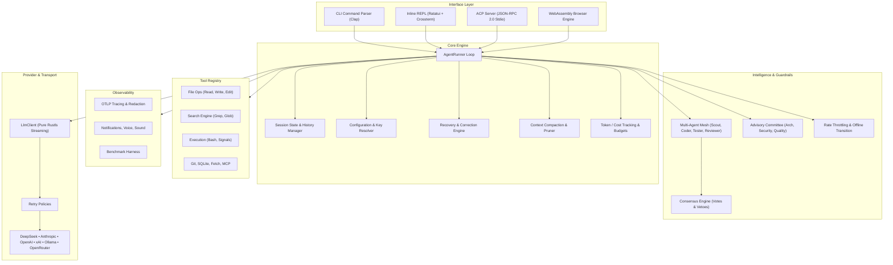

# Architecture Overview

Fusion is crafted with clean separation of concerns and zero unnecessary abstraction layers:



## Pure Rust Dependency Manifesto

- **No C/C++ build dependencies**: Avoids `gcc`, `clang`, `cmake`, and `make` during installation.
- **No OpenSSL**: Eliminates shared object version mismatches across Linux distributions and Android NDK.
- **No Protocol Buffers compiler**: Zero requirement for external `protoc` binaries.

## Source Layout

```text
src/
  acp/          ACP JSON-RPC 2.0 server, event streaming, WebSocket bridge
  agent/        AgentRunner loop, mesh, subagents, advisors, consensus,
                recovery, compaction, pruner, undo, bookmarks, cost,
                tracing (OTLP), throttle, skills, snippets, fork/rewind
  cli/          CLI parsing, shell completion generation
  config/       Config loading, env resolution, migration, presets, workspaces
  provider/     LlmClient, provider adapters, model catalog, retry, offline mode
  tools/        Sandboxed tool registry (files, search, git, sqlite, MCP, ...)
  ui/           Inline REPL, markdown renderer, slash commands, themes, voice
  wasm.rs       WASM bindings, VirtualFs, browser engine
sdk/            TypeScript SDK (@fusion/sdk) — types, xterm adapter, WASM core
web/            Browser playground (xterm.js + WebSocket ACP)
Formula/        Homebrew formula
benches/        Criterion micro-benchmarks & provider comparison harness
scripts/        install.sh, termux-bootstrap.sh, package.sh, verify.sh
tests/          CLI, multi-agent, smoke, and WASM integration tests
```
